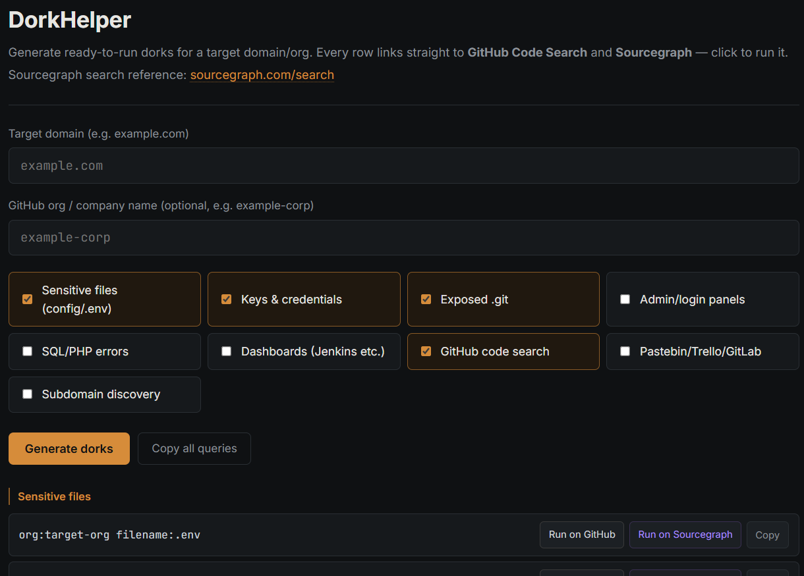
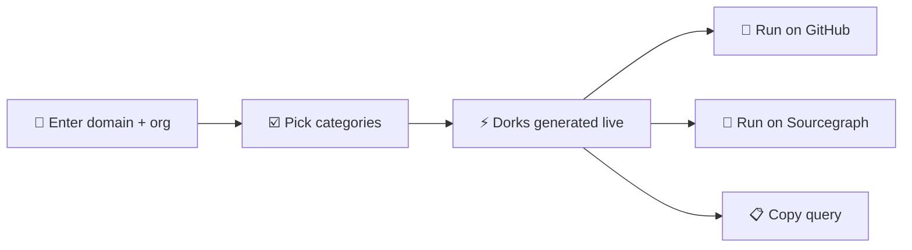

# 🔎 GitHubDork

**Generate ready-to-run GitHub & Sourcegraph dorks for any target, in one click.**
A single-file, zero-install helper for bug bounty hunters and pentesters.

 

<!-- Replace with a screenshot of the tool -->

[How it works](#-how-it-works) · [Features](#-features) · [Usage](#-usage) · [Dork categories](#-dork-categories) · [Customize](#-customize) · [Responsible use](#%EF%B8%8F-responsible-use)

---

## 💡 What is it?

Finding leaked secrets in public code means writing the same search queries over and over. **GitHubDork** builds them for you.

Type a target domain and a GitHub org name, pick the categories you care about, and get a list of dorks. Every row has a button that opens the query directly on **GitHub Code Search** or **Sourcegraph**.

It only builds queries and links out. It doesn't scan anything or send requests on your behalf.

## ⚙️ How it works

## ✨ Features

| | |
|---|---|
| ⚡ **Live results** | The list updates as you type or toggle a category. No refresh needed. |
| 🔗 **One-click search** | Each dork has **Run on GitHub** and **Run on Sourcegraph** buttons. |
| 🔄 **Auto-translation** | GitHub syntax (`org:`, `filename:`) is converted to Sourcegraph syntax (`repo:`, `file:`) on the fly. Best effort, so double-check complex queries. |
| 📋 **Copy one or all** | Copy a single query, or every visible query at once. |
| 🗂️ **9 categories, 30 dorks** | Secrets, keys, git credentials, panels, debug configs, dashboards, leaks and more. |
| 📦 **Zero dependencies** | One HTML file. No build step, no backend, no install. |
| 🌙 **Dark UI** | Easy on the eyes during long recon sessions. |

---

## 🚀 Usage

**Option 1: run locally**

1. Download `GithubDorkhelper.html`
2. Open it in any modern browser

**Option 2: host it on GitHub Pages**

1. Push the file to your repo (rename it to `index.html` if you want it at the root URL)
2. Go to **Settings → Pages** and select your branch
3. Open the published URL

**Then:**

1. Enter the **target domain** (e.g. `example.com`)
2. Enter the **GitHub org** (e.g. `example-corp`), optional
3. Tick the categories you want
4. Click **Run on GitHub** or **Run on Sourcegraph** on any row, or copy the query

> 💡 GitHub code search requires you to be signed in to GitHub. Sourcegraph's public search works without an account.

If you leave the org empty, the placeholder `target-org` is used, so remember to fill it in before running anything.

---

## 🗂️ Dork categories

| Category | Default | Example query |
|---|:---:|---|
| 📄 Sensitive files | ✅ | `org:target-org filename:.env` |
| 🔑 Keys & credentials | ✅ | `org:target-org "BEGIN RSA PRIVATE KEY"` |
| 🧬 Leaked git credentials | ✅ | `org:target-org filename:.git-credentials` |
| 🔍 General code search | ✅ | `org:target-org "example.com"` |
| 🚪 Admin/login panels | | `org:target-org "wp-admin" "password"` |
| 🐞 Debug/error configs | | `org:target-org "APP_DEBUG=true"` |
| 📊 CI & dashboard configs | | `org:target-org filename:Jenkinsfile "password"` |
| 📝 Pastebin/Trello mentions | | `org:target-org "pastebin.com"` |
| 🌐 Subdomain/endpoint discovery | | `org:target-org "example.com.internal"` |

Every category contains 3 to 4 queries. Categories marked ✅ are enabled by default.

---

## 🛠️ Customize

Everything lives in the one HTML file:

- **Add or edit a dork:** change the lists inside `buildDorks()`
- **Add a category:** add an entry to `CATS`, a label to `LABELS`, and a list in `buildDorks()`
- **Change colors:** edit the CSS variables at the top (`--amber`, `--bg`, `--panel`, ...)

---

## 🔒 Privacy

- No data is sent to any server by the tool itself
- The only request made on page load is for the **Inter** and **JetBrains Mono** fonts from Google Fonts
- Your domain and org are only used in the links you choose to open

---

## ⚖️ Responsible use

This tool is for authorized security research and bug bounty work. Only dig into targets that are **in scope** for a program you're participating in, or that you have permission to test.

If you find exposed secrets:

- Don't use them, and don't test whether they still work unless the program explicitly allows it
- Report them to the owner through the proper channel
- Follow the program's rules on disclosure

## 📄 License

Released under the [MIT License](LICENSE).

Built for hunters who read code before they read headers. 🔎

